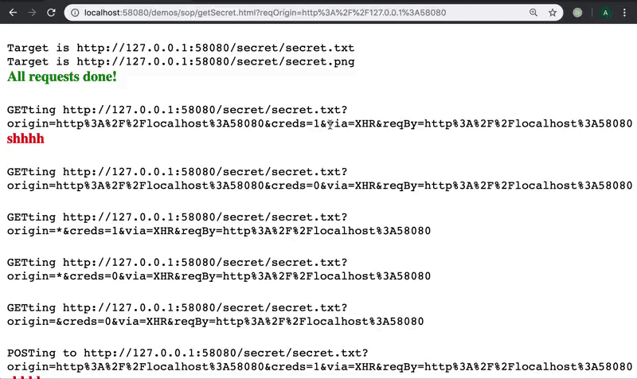
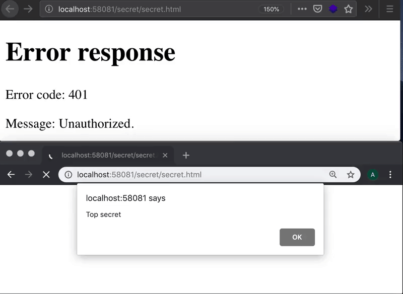

# Description

This is a multi-threaded HTTPS server based on python's simple http server. It is not built with security in mind and is **not** suitable for production. Its sole purpose is for testing the same-origin policy of browsers, and CORS misconfigurations of other servers.

# Table of contents

  * [Description](#description)
  * [Features](#features)
    - [Special endpoints](#special-endpoints)
  * [To do](#to-do)
  * [Use cases](#use-cases)
    - [Same-origin browser test](#same-origin-browser-test)
      + [Running the server](#running-the-server)
      + [Viewing results, logging to file and parsing it](#viewing-results-logging-to-file-and-parsing-it)
    - [Data exfiltration via CSRF](#data-exfiltration-via-csrf)
      + [Running the server](#running-the-server-1)
  * [Usage](#usage)

# Features

  * SSL (disabled by default)
  * Dummy authentication (no credentials required, but issues cookies)
  * Paths requiring authentication (dummy cookies issued by the server)
  * Multi-threading (disabled by default)
  * Easily configure default CORS-related headers (`Access-Control-Allow-*`) via command line or on a per-request basis using the `origin` and `creds` URL parameters (if `origin` is `{ECHO}` it is taken from the `Origin` header in the request)
  * Other custom headers via command line only

## Special endpoints
  * `GET /login`: issues a random `SESSION` cookie
    - Supported parameters:
      + `goto`: redirect to this URL
    - Response codes:
      + `200 OK`: empty body
      + `302 OK`: Location is as requested via the `goto` parameter
    - Notes:
      + Sessions are forgotten on the server side upon restart
      + Cookies are issued with the `HttpOnly` flag, and if over SSL with the `Secure` flag as well
  * `GET /logout`: clears the `SESSION` cookie from the browser and the server
    - Supported parameters:
      + `goto`: redirect to this URL
    - Response codes:
      + `200 OK`: empty body
      + `302 OK`: Location is as requested via the `goto` parameter
  * `POST /echo`: render the requested content
    - Supported parameters:
      + `data`: the encoded content of the page to be rendered (required)
      + `type`: the content type of the rendered page (defaults to text/plain)
    - Supported formats:
      + `application/json` with `base64` encoded data
      + `application/x-www-form-urlencoded` (with URL encoded data)
    - Response codes:
      + `200 OK`: the body and `Content-Type` are as requested
      + `400 Bad Request`: cannot decode data or find the data parameter
  * `POST /cache/{name}`: temporarily save the requested content (in memory only)
    - Supported parameters and formats are the same as for `POST /echo`
    - Response codes:
      + `204 No Content`: page cached
      + `500 Server Error`: maximum cache memory reached, or page `{name}` already cached
    - Notes:
      + Once saved, a page cannot be overwritten (until the server is shutdown) even if it is cleared from memory (see /cache/clear)
  * `GET /cache/{name}`: retrieve a previously saved page
    - Response codes:
      + `200 OK`: the body and `Content-Type` are as requested during caching
      + `500 Server Error`: no such cached page, or page cleared from memory
  * `GET /cache/clear/{name}`: clear a previously saved page to free memory
    - Response codes:
      + `204 No Content`: page cleared
  * `GET /cache/clear`: clear all previously saved pages to free memory
    - Response codes:
      + `204 No Content`: all pages cleared
  * `GET /cache/new`: get a random UUID
    - Response codes:
      + `200 OK`: body contains a randomly generated UUID; use in `POST /cache/{uuid}`

# To do

  * MT-safe saving and clearing of cache

# Use cases

## Same-origin browser test



The html page in `/demos/sop` can be used to test the behaviour of various browsers (many old ones supported) when it comes to cross-origin requests.

  * `getSecret.html`: fetches `/secret/secret.txt` or `/secret/secret.png` using 6 different methods (see below), for each requesting 5 CORS combinations from the server (see below); supported URL parameters:
    - `host`: the full hostname/IP address:port of the target
    - `hostname`: only the hostname/IP address of the target; the port number will be the same as the origin
    - `port`: only the port number of the target; the hostname/IP address will be the same as the origin

`getSecret.html` will log in to the target origin, and fetch `https://<target_origin>/secret/secret.<txt or png>?origin=...&creds=...` requesting each one of the following 5 CORS combinations from the server:
  * Origin: `<as request origin>` , Credentials: true
  * Origin: `<as request origin>` , Credentials: false
  * Origin: `*` , Credentials: true
  * Origin: `*` , Credentials: false
  * no CORS headers

It will do so using each the following six methods:
  * GET `/secret/secret.txt` via XMLHttpRequest
  * POST `/secret/secret.txt` via XMLHttpRequest
  * GET `/secret/secret.txt` via `<iframe>`
  * GET `/secret/secret.txt` via `<object>`
  * GET `/secret/secret.png` via ``, then draw it in a 2D canvas
  * GET `/secret/secret.png` via ``, then draw it in a bitmap canvas

#### Running the server

`getSecret.html` will determine the target origin using any of the `host`, `hostname` or `port` URL parameters, in this order of precedence. If neither is given, it will present an input prompting you for the target origin.

You have these options for CORS testing:

1. Start the server on all interfaces (default):

```
python3 simple.py -S -l demos/sop/logs/requests_vary_host.log
```

Visit:

```
https://<IP_1>:58080/demos/sop/getSecret.html?hostname=<IP_2>
```

replacing `<IP_1>` and `<IP_2>` with two different interfaces, e.g. `127.0.0.1` and `192.168.0.1`.

2. Alternatively, start it only on one interface:

```
python3 simple.py -S -a <IP> -l demos/sop/logs/requests_vary_host.log
```

and use a DNS name which resolves to the interface's IP address:

```
https://<IP>:58080/demos/sop/getSecret.html?hostname=<hostname>
```

or:

```
https://<hostname>:58080/demos/sop/getSecret.html?hostname=<IP>
```

You can omit the hostname URL parameter if listening on `localhost` and `localhost` has the `127.0.0.1` address. `getSecret.html` will detect that and use `localhost` or `127.0.0.1` as the target domain (if the origin is `127.0.0.1` or `localhost` respectively).

3. Alternatively, run two different instances on one interface but different ports:

```
python3 simple.py -S -a <IP> -p 58081 -l demos/sop/logs/requests_vary_port_target.log
python3 simple.py -S -a <IP> -p 58082 -l demos/sop/logs/requests_vary_port_origin.log
```

then visit:

```
https://<IP>:58082/demos/sop/getSecret.html?port=58081
```

#### Viewing results, logging to file and parsing it

Results from the requests calls will be logged to the page; check the JS console for CORS security errors. Full requests from the browser will be logged to the logfile given by the `-l` option.

To check the exfiltrated data is as it should be, do:

```
demos/sop/test_exfiltrated_data.sh
```

To parse the script and print the results in a table do:

```
cd demos/sop
./parse_request_log.sh logs/requests_vary_host.log logs/request_vary_host_table.md
cat logs/request_vary_port_target.log logs/request_vary_port_origin.log > logs/request_vary_port.log
./parse_request_log.sh logs/requests_vary_port.log logs/request_vary_port_table.md
```

The folder already contains logs and results for many browsers.

## Data exfiltration via CSRF



The html pages in `/demos/csrf` can be used to test for [CSRF](https://www.owasp.org/index.php/Cross-Site_Request_Forgery_%28CSRF%29) vulnerabilities.

  * `getData.html`: requests a new cache UUID for saving the exfiltrated data to and presents you with an input field where you put the URL of the secret page you want to fetch via the victim; then generates a URL for the victim to click on (`evil.html`); supported URL parameters:
    - `post`: fetch target using POST instead of GET
  * `evil.html`: this is the page you send to the victim; it will fetch the data and cache it in the server under the previously generated UUID; supported URL parameters:
    - `reqURL`: the URL of the page to fetch
    - `sendURL`: the URL of the page to send the data to
    - `post`: fetch using POST instead of GET

#### Running the server

The "victim" (`evil.html`) and "attacker" (`getData.html`) must be loaded in different browsers.

Start the server on any interface, e.g.:

```
python3 simple.py -S
```

Visit `getData.html` in one browser:

```
https://<IP>:58080/demos/csrf/getData.html
```

then input the target URL in the input box, e.g.:

```
https://<IP>:58080/secret/secret.html
```

Copy the generated victim URL. Click on the link "Click here to wait for the stolen data". Open the copied link in another browser.
Refresh the cached page to see the stolen secret data.

Note: The cached page should refresh itself every 30s.

# Usage

```
usage: simple.py [-h] [-a IP] [-p PORT] [-o [Origin [Origin ...]] | -O]
                 [-x [Header: Value [Header: Value ...]]]
                 [-m [Header: Value [Header: Value ...]]] [-c] [-s] [-C FILE]
                 [-K FILE] [-H [Header: Value [Header: Value ...]]]
                 [-S [DIR|FILE [DIR|FILE ...]]] [-l FILE] [-d] [-t]

Serve the current working directory over HTTPS and with custom headers. The
CORS related options (-o and -c) define the default behaviour. It can be
overriden on a per-request basis using the origin and creds URL parameters.
creds should be 0 or 1. origin is taken literally unless it is `{ECHO}`, then
it is taken from the Origin header in the request.

optional arguments:
  -h, --help            show this help message and exit

Listen options:
  -a IP, --address IP   Address of interface to bind to. (default: 0.0.0.0)
  -p PORT, --port PORT  HTTP port to listen on. Default is 58080 if not over
                        SSL or 58443 if over SSL. (default: None)

CORS options (requires -o or -O):
  -o [Origin [Origin ...]], --allowed-origins [Origin [Origin ...]]
                        Allowed origins for CORS requests. Can be "*"
                        (default: [])
  -O, --allow-all-origins
                        Allow all origins, i.e. echo the Origin in the
                        request. (default: None)
  -x [Header: Value [Header: Value ...]], --allowed-headers [Header: Value [Header: Value ...]]
                        Headers allowed for CORS requests. (default:
                        ['Accept', 'Accept-Language', 'Content-Language',
                        'Content-Type', 'Authorization'])
  -m [Header: Value [Header: Value ...]], --allowed-methods [Header: Value [Header: Value ...]]
                        Methods allowed for CORS requests. (default: ['POST',
                        'GET', 'OPTIONS', 'HEAD'])
  -c, --allow-credentials
                        Allow sending credentials with CORS requests, i.e. add
                        Access-Control-Allow-Credentials. Using this only
                        makes sense if you are providing some list of origins
                        (see -o and -O options), otherwise this option is
                        ignored. (default: False)

SSL options:
  -s, --ssl             Use SSL. (default: False)
  -C FILE, --cert FILE  PEM file containing the server certificate. (default:
                        ./cert.pem)
  -K FILE, --key FILE   PEM file containing the private key for the server
                        certificate. (default: ./key.pem)

Misc options:
  -H [Header: Value [Header: Value ...]], --headers [Header: Value [Header: Value ...]]
                        Additional headers to include in the response.
                        (default: [])
  -S [DIR|FILE [DIR|FILE ...]], --secrets [DIR|FILE [DIR|FILE ...]]
                        Directories or files which require a SESSION cookie.
                        If no leading slash then it is matched anywhere in the
                        path. (default: ['secret'])
  -l FILE, --logfile FILE
                        File to write requests to. Will write to stdout if not
                        given. (default: None)
  -d, --debug           Enable debugging output. (default: 20)
  -t, --multithread     Enable multi-threading support. EXPERIMENTAL! You ma
                        experience crashes. The cache has not been implemented
                        in an MT safe way yet. (default: HTTPServer)
```
